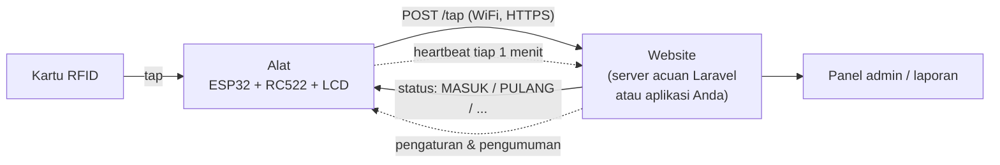
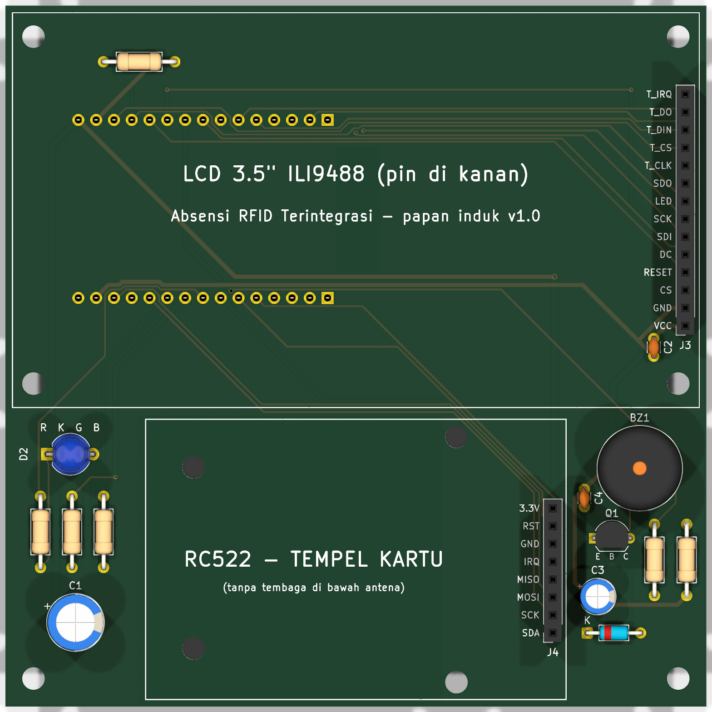
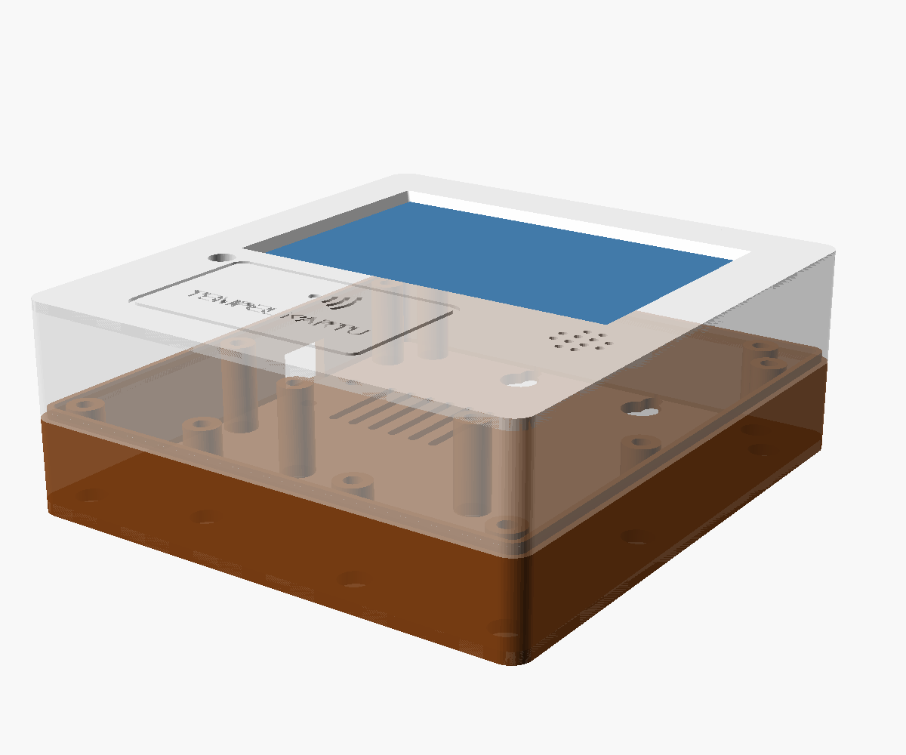

# Absensi RFID Terintegrasi

Alat absensi **tap kartu RFID** berbasis ESP32 yang **terhubung langsung ke website**. Kartu ditempel, alat mengirim nomornya ke server lewat WiFi (HTTP/HTTPS), dan hasilnya (MASUK / PULANG / tidak terdaftar) tampil di layar sentuh 3.5", LED RGB, dan bunyi buzzer. Semua data kehadiran tersimpan di website, bukan di alat.

*Open-source RFID attendance terminal (ESP32 + RC522 + 3.5" touch LCD) that talks to any web app through a small HTTP API. Includes firmware, a Laravel reference server, integration examples, perfboard/PCB layouts and a 3D-printed case. Documentation is in Indonesian.*

Repositori ini berisi **semua yang dibutuhkan dari nol sampai alat jadi**: daftar komponen, kabel prototipe, firmware, server + panel admin, contoh integrasi ke aplikasi lain, tata letak PCB, dan casing cetak 3D.

---

## Daftar isi

- [Fitur](#fitur)
- [Status proyek](#status-proyek-baca-dulu)
- [Cara kerja](#cara-kerja)
- [Peta tahapan](#peta-tahapan)
- [Tahap 0 — Siapkan komponen, alat, dan software](#tahap-0--siapkan-komponen-alat-dan-software)
- [Tahap 1 — Prototipe dengan kabel jumper](#tahap-1--prototipe-dengan-kabel-jumper)
- [Tahap 2 — Firmware](#tahap-2--firmware)
- [Tahap 3 — Backend (website)](#tahap-3--backend-website)
- [Tahap 4 — PCB](#tahap-4--pcb)
- [Tahap 5 — Casing cetak 3D](#tahap-5--casing-cetak-3d)
- [Pemecahan masalah](#pemecahan-masalah)
- [Struktur folder](#struktur-folder)
- [Untuk kontributor](#untuk-kontributor)
- [Lisensi](#lisensi)

---

## Fitur

**Alat (firmware ESP32)**
- Tap kartu MIFARE 13,56 MHz (RC522), hasil tampil dalam ± 0,4–0,6 detik di jaringan normal.
- Semua pengaturan lewat **layar sentuh**: pilih WiFi, isi password, Base URL server, dan API key. Tidak perlu mengubah kode untuk tiap lokasi.
- **Antrean offline** 200 tap: kalau server tidak bisa dihubungi, tap disimpan dan dikirim ulang otomatis (tanpa catatan ganda berkat `tap_id`).
- Foto pemilik kartu (JPEG kecil), pesan dari server, jam tersinkron.
- **Screensaver pengumuman** (judul, isi, ikon) yang diambil dari website.
- **Layar meredup** saat alat diam; kartu tetap terbaca.
- Menu Pengaturan ber-PIN, kalibrasi layar, tes buzzer & LED, cek kabel RFID, reset pabrik (tekan EN 3 kali).
- Heartbeat tiap menit, sehingga website tahu alat mana yang aktif.
- Tahan menyala lama: **watchdog** (restart sendiri kalau program macet) dan **restart harian terjadwal** saat sepi (jamnya diatur per alat dari website, bawaan 03:00).

**Website**
- **API sederhana** (`/ping`, `/tap`, `/heartbeat`, opsional `/announcements`) yang bisa diterapkan di aplikasi apa saja: lihat [doc/spesifikasi-api.md](doc/spesifikasi-api.md).
- **Server acuan Laravel** dengan panel admin: anggota & kartu, kehadiran, kartu belum terdaftar, rekap + CSV, daftar alat (PIN per alat), pengumuman, pengaturan (API key, judul, layar redup).
- **Contoh integrasi** PHP dan Node.js tanpa framework, skrip pemeriksa server, dan koleksi Postman lengkap.

---

## Status proyek (baca dulu)

Supaya tidak ada yang tersesat: bagian di bawah ini dibedakan antara yang **sudah diuji di alat sungguhan** dan yang **baru berupa desain**.

| Bagian | Status |
|---|---|
| Prototipe kabel jumper di expansion board | ✅ Dirakit dan berjalan |
| Firmware v1.3.0 | ✅ Berjalan di alat prototipe (tap, antrean, pengumuman, layar redup) |
| Firmware v1.4.0 (watchdog, restart harian, identitas baru) | ✅ Berjalan di alat (boot, tap, heartbeat, watchdog aktif); ⚠️ restart harian **belum diuji** |
| Server Laravel + panel admin | ✅ Dipakai di server percobaan; 127 tes otomatis lulus |
| Contoh integrasi PHP/Node + Postman | ✅ Lolos skrip pemeriksa dan 114 pemeriksaan Postman |
| PCB dot matrix (papan bolong) | ⚠️ Tata letak dan panduan selesai, **belum dirakit fisik** |
| PCB cetak (KiCad) | ⚠️ Desain lolos DRC, **belum dipesan dan belum diuji** |
| Casing cetak 3D | ⚠️ Desain lolos cek tabrakan otomatis, **belum dicetak** |

Kalau Anda merakit bagian yang bertanda ⚠️, lakukan cek cetak kertas 1:1 yang dijelaskan di tahap itu, dan laporkan hasilnya lewat *Issues*.

---

## Cara kerja



1. Kartu ditempel. Alat membaca UID kartu dan mengubahnya menjadi **nomor 10 digit**.
2. Alat mengirim `POST {Base URL}/tap` dengan header `X-API-Key` dan `X-Device-ID`.
3. Website memutuskan statusnya (`check_in`, `check_out`, `duplicate`, `unknown`, `rejected`) dan membalas nama, pesan, dan (opsional) URL foto.
4. Alat menampilkan hasil, berbunyi, dan menyalakan LED sesuai status.

Website juga bisa mengirim **pengaturan jarak jauh** (PIN menu, judul layar, layar redup) dan **pengumuman** ke alat. Kontrak lengkapnya ada di [doc/spesifikasi-api.md](doc/spesifikasi-api.md).

---

## Peta tahapan

| Tahap | Hasil | Dokumen utama |
|---|---|---|
| 0. Persiapan | Komponen, alat, software siap | bagian di bawah |
| 1. Prototipe | Rangkaian kabel jumper berjalan | [doc/skema-lengkap.md](doc/skema-lengkap.md), [doc/rakit-lengkap.html](doc/rakit-lengkap.html) |
| 2. Firmware | Alat membaca kartu dan tampil di layar | [firmware/](firmware/) |
| 3. Backend | Website menerima tap, panel admin | [api/README.md](api/README.md), [doc/spesifikasi-api.md](doc/spesifikasi-api.md), [contoh-integrasi/](contoh-integrasi/README.md) |
| 4. PCB | Rangkaian rapi tanpa kabel jumper | [doc/rakit-dotmatrix.html](doc/rakit-dotmatrix.html), [doc/pcb-papan-induk.md](doc/pcb-papan-induk.md) |
| 5. Casing | Alat jadi, siap dipasang di dinding | [doc/casing.md](doc/casing.md) |

> **File `.html`** di folder `doc/` adalah panduan interaktif. GitHub hanya menampilkan kodenya, jadi **unduh repositori lalu buka file itu di browser** (dobel klik).

---

## Tahap 0 — Siapkan komponen, alat, dan software

### Komponen (1 unit)

| Komponen | Keterangan | Catatan |
|---|---|---|
| ESP32 DOIT DevKit V1 **30 pin** | Chip USB CH340, jarak dua deret pin 25,4 mm | Varian 38 pin **tidak** cocok dengan PCB dan casing |
| LCD 3.5" SPI **ILI9488** + touch **XPT2046** | 480 × 320, 14 pin di satu sisi pendek, PCB 98 × 56,34 mm (kompatibel LCDWIKI MSP3520) | Jumper **J1** di belakang LCD harus disolder (lihat Tahap 1) |
| RFID **RC522** | Modul standar 60 × 40 mm, 8 pin, 3,3 V | Header pin lurus |
| LED RGB 5 mm **common cathode** | 4 kaki, kaki terpanjang = katoda (−) | Bukan *common anode* |
| Buzzer **aktif** 3–5 V | 2 kaki, berbunyi sendiri bila diberi tegangan | Bukan buzzer pasif |
| Kartu / gantungan kunci MIFARE 13,56 MHz | Biasanya satu paket dengan RC522 | |
| Kabel USB data + adaptor 5 V | Untuk daya alat | |

**Untuk prototipe (Tahap 1):** expansion board ESP32 30 pin (header G-V-S per pin) dan ± 30 kabel jumper female-female.
**Untuk versi rapi (Tahap 4):** papan dot matrix atau PCB cetak beserta komponen kecilnya (resistor, transistor, dioda, kapasitor, header female). Daftarnya ada di tahap itu.

### Alat

Solder + timah, tang potong, multimeter (mode bunyi dan volt DC), obeng kecil. Untuk Tahap 4: cutter, bor 3 mm, lem. Untuk Tahap 5: baut M3 dan spacer.

### Software

| Software | Untuk | Versi yang dipakai di proyek ini |
|---|---|---|
| [Arduino IDE 2](https://www.arduino.cc/en/software) (atau `arduino-cli`) | Firmware | IDE 2.3.10 / arduino-cli 1.5.1 |
| Paket board **esp32 by Espressif Systems** | Firmware | 3.3.12 |
| PHP 8.3 + Composer + PostgreSQL | Server acuan (Tahap 3) | PHP 8.3, Laravel 13 |
| KiCad 10 (opsional) | Membuka / mengubah PCB cetak | 10.0.6 |
| OpenSCAD versi *snapshot* (opsional) | Membuka / mengubah casing | 2026.09.30 |
| Python 3 + PyMuPDF (opsional) | Membuat ulang templat dot matrix | |

---

## Tahap 1 — Prototipe dengan kabel jumper

Tujuannya membuktikan semua komponen berfungsi sebelum dibuat rapi. **Cabut USB setiap kali memasang atau memindah kabel.**

### 1.1 Aturan daya (penting)

- **Semua komponen memakai 3,3 V.** Jangan ada kabel ke pin 5V.
- Di expansion board, jumper **JUMP** harus di posisi **3.3V** (mengatur semua pin V).
- Pakai satu kabel USB saja, ke port **ESP32** (bukan port expansion).
- ESP32 hanya bisa tersambung ke WiFi **2,4 GHz**.

### 1.2 Solder jumper J1 di LCD

Menurut skema resmi modul LCD: kalau VCC diberi **3,3 V**, jumper **J1 harus disambung** (dijembatani timah). Kalau VCC 5 V, J1 dibiarkan terbuka. Rangkaian ini memakai 3,3 V, jadi:

1. Cari bantalan bertanda **J1** di belakang LCD (dekat regulator U1).
2. Sambungkan kedua bantalannya dengan sedikit timah.
3. Setelah J1 disambung, **VCC LCD tidak boleh lagi diberi 5 V**: chip layar bisa rusak.

### 1.3 Pasang kabel

Ikuti [doc/skema-lengkap.md](doc/skema-lengkap.md) (versi interaktif: [doc/rakit-lengkap.html](doc/rakit-lengkap.html)). Ringkasan pin:

| Bagian | Pin modul → GPIO ESP32 |
|---|---|
| LCD | VCC → 3V3, GND → GND, CS → 5, RESET → 4, DC → **16**, SDI → 23, SCK → 18, **LED → 2**, SDO tidak disambung |
| Touch | T_CLK → 22, T_CS → 15, T_DIN → 21, T_DO → 19, T_IRQ tidak disambung |
| RC522 | SDA → 33, SCK → 14, MOSI → 13, MISO → 35, RST → 32, 3.3V → 3V3, GND → GND, IRQ tidak disambung |
| Buzzer aktif | + → 17, − → GND |
| LED RGB | R → 25, G → 26, B → 27, kaki terpanjang (K) → GND |

Catatan:
- **DC jangan di GPIO2.** Pin LED LCD (lampu latar) memang di GPIO2; firmware memakainya untuk meredupkan layar. Kalau LED LCD disambung ke 3V3, layar menyala terus tanpa fitur redup.
- Pin **GPIO12 jangan dipakai** (pin boot yang membuat ESP32 gagal menyala).
- Resistor 220–330 Ω di tiap kaki warna LED RGB disarankan. Untuk prototipe boleh tanpa resistor karena firmware membatasi arus pin.

### 1.4 Tes per bagian

Sebelum menjalankan tes, siapkan software di [Tahap 2.1](#21-pasang-software). Sketsa tes ada di [firmware/tes/](firmware/tes/):

| Urutan | Sketsa | Yang dites | Hasil yang benar |
|---|---|---|---|
| 1 | `tes_touch` | Layar + layar sentuh | Muncul kalibrasi 3 titik, lalu mode menggambar: titik muncul tepat di bawah jari/stylus |
| 2 | `tes_miso` | Kabel MOSI dan MISO RC522 tidak bersentuhan | Monitor serial menulis `AMAN` terus-menerus |
| 3 | `tes_rfid` | RC522 menjawab | Baris pertama (susunan kabel yang direncanakan) diakhiri `<== RC522 MENJAWAB` |

Buzzer dan LED dites dari firmware utama (menu **Tes buzzer & LED**), setelah Tahap 2.

---

## Tahap 2 — Firmware

Kode ada di [firmware/absensi/](firmware/absensi/). Bahasa komentar: Indonesia.

### 2.1 Pasang software

1. Pasang **Arduino IDE 2**.
2. **Tools → Board → Boards Manager**, cari `esp32`, pasang **esp32 by Espressif Systems** (dipakai: 3.3.12). Kalau tidak muncul, tambahkan URL `https://espressif.github.io/arduino-esp32/package_esp32_index.json` di **Settings → Additional boards manager URLs**.
3. **Tools → Manage Libraries**, pasang:

   | Library | Versi dipakai | Untuk |
   |---|---|---|
   | TFT_eSPI (Bodmer) | 2.5.43 | Layar |
   | RFID_MFRC522v2 | 2.0.6 | RC522 |
   | ArduinoJson (Benoit Blanchon) | 7.4.3 | JSON |
   | TJpg_Decoder (Bodmer) | 1.1.0 | Foto |
   | XPT2046_Touchscreen (Paul Stoffregen) | 1.4 | Hanya untuk sketsa `tes_touch` |

   Pengaturan pin layar ada di `tft_setup.h` di folder sketsa dan dibaca otomatis oleh TFT_eSPI. **File library tidak perlu diubah.**
4. **Mac Apple Silicon:** pasang Rosetta 2 (alat `ctags` di paket Arduino masih x86):
   ```bash
   softwareupdate --install-rosetta --agree-to-license
   ```
5. **Windows:** pasang driver **CH340** kalau port COM tidak muncul.

### 2.2 Atur ID alat

Buka [firmware/absensi/config.h](firmware/absensi/config.h), ubah `ID_ALAT` (bawaan `"ABS-001"`). **Setiap alat harus punya ID berbeda**; ID ini dikirim sebagai `X-Device-ID` dan tidak terhapus saat reset pabrik. Isi `""` supaya dibuat otomatis dari alamat MAC (contoh `ABS-79438C`).

Pengaturan lain di file yang sama (biasanya tidak perlu diubah): PIN bawaan `2026`, interval heartbeat 60 detik, batas antrean 200, batas waktu tap 3 detik, layar redup 60 detik ke 20 %.

### 2.3 Upload

**Lewat Arduino IDE (semua sistem operasi):**
1. Buka `firmware/absensi/absensi.ino`.
2. Board: **ESP32 Dev Module** (bukan "DOIT ESP32 DEVKIT V1", karena yang itu tidak punya menu partisi).
3. **Partition Scheme: Huge APP (3MB No OTA/1MB SPIFFS)**. Wajib: firmware ± 1,3 MB tidak muat di partisi bawaan.
4. Upload Speed: **460800** (Mac/Linux). Kalau upload gagal atau di Windows, pakai **115200**.
5. Pilih port, klik Upload. Kalau tertahan di `Connecting....`, tahan tombol **BOOT** sampai persentase muncul.

**Lewat skrip (Mac/Linux, butuh `arduino-cli`):** dari folder `firmware/`:
```bash
./upload.sh -m              # compile + upload firmware utama, lalu buka monitor serial
./upload.sh -c              # compile saja (cek tanpa alat)
./upload.sh tes_rfid -m     # upload sketsa tes
./monitor.sh                # monitor serial 115200 baud, keluar: Ctrl+C
PORT=/dev/ttyUSB0 ./upload.sh    # pilih port sendiri
```
Skrip memakai partisi Huge APP dan kecepatan 460800 secara otomatis. `arduino-cli` dicari di `PATH`, lalu di dalam Arduino IDE (macOS). Lokasi lain: `ARDUINO_CLI=/path/arduino-cli ./upload.sh`.

### 2.4 Siapkan server sementara (kalau website belum ada)

Saat pertama menyala, alat meminta **Base URL** dan **API key**. Kalau server Tahap 3 belum siap, jalankan contoh server PHP di laptop (satu WiFi dengan alat):

```bash
cd contoh-integrasi/php
php -S 0.0.0.0:8080 index.php
```

Base URL-nya `http://<IP-laptop>:8080`, API key `ganti-dengan-kunci-anda`. Kartu contoh yang terdaftar: `0218893066` dan `0012345678` (`0055555555` sengaja nonaktif). Kartu Anda sendiri akan tampil "tidak terdaftar" sampai nomornya ditambahkan ke data contoh. Ini cukup untuk membuktikan alat bekerja. Rinciannya: [contoh-integrasi/README.md](contoh-integrasi/README.md).

### 2.5 Pertama kali menyala

Alat baru (atau setelah reset pabrik) menjalankan urutan ini:
1. **Kalibrasi layar sentuh** 3 titik (hanya kalau belum pernah).
2. **Panduan 4 langkah:**
   1. **WiFi**: pilih dari hasil pindai (atau "Ketik manual"), isi password.
   2. **Base URL**: sudah terisi `https://`. Lengkapi, contoh `https://absensi.example.com/api/absensi` atau `http://192.168.1.10:8080`. Tanpa `/` di akhir.
   3. **API key**: sama persis dengan di server.
   4. **Tes koneksi**, lalu **Simpan**.
3. Layar utama tampil. Tempel kartu.

Monitor serial (115200 baud) menampilkan catatan seperti `RFID: RC522 terdeteksi`, `HTTP POST /tap -> 200`, dan `Tap: 245 ms`.

### 2.6 Menu dan fitur alat

| Fitur | Cara |
|---|---|
| Menu Pengaturan | Ikon gir di layar utama, PIN bawaan **2026** (5 kali salah = terkunci 60 detik). Menu tertutup sendiri setelah 60 detik tanpa sentuhan |
| Isi menu | WiFi, Server, Tes koneksi, Info alat, Ganti PIN, Kalibrasi layar, Tes buzzer & LED, Tes screensaver, Cek kabel RFID, Reset pabrik |
| Kalibrasi ulang layar | Menu **Kalibrasi layar**, atau tekan **EN** lalu tekan **BOOT** saat muncul "Tekan BOOT sekarang" (jeda 1 detik) |
| Reset pabrik | Tekan **EN 3 kali berturut-turut** (masing-masing sebelum alat menyala 5 detik), lalu pilih "Ya, reset"; atau lewat menu. Menghapus WiFi, URL, API key, PIN, judul, kalibrasi, antrean, pengumuman. **ID alat tidak terhapus** |
| Layar redup | Setelah diam 60 detik, layar meredup ke 20 %. Kartu tetap diproses. Sentuhan pertama hanya menyalakan layar. Angka bisa diubah dari website (`dim_after`, `dim_level`) |
| Antrean offline | Server tidak terjangkau → tap disimpan (maks. 200) dan dikirim ulang saat alat diam |
| Restart harian | Sekali sehari pada jam yang diatur per alat di website (bawaan **03:00**, jam alat), hanya saat alat diam. Antrean tap tetap tersimpan. Kosongkan jamnya di website untuk mematikan |
| Watchdog | Kalau program macet lebih dari 60 detik, alat restart sendiri. Alasan restart terakhir terlihat di **Info alat → Restart** dan dikirim ke website |
| Pengaturan dari website | PIN menu (per alat), jam restart (per alat), judul layar, layar redup, pengumuman |

---

## Tahap 3 — Backend (website)

Pilih salah satu (boleh keduanya):

### 3.A Pakai server acuan Laravel (paling cepat)

Server lengkap dengan panel admin ada di [api/](api/README.md). Ringkasnya:

```bash
cd api
composer install
cp .env.example .env          # isi DB_* (PostgreSQL) dan APP_URL
php artisan key:generate
php artisan migrate           # membuat akun "admin" (tanpa password) dan API key acak
php artisan absensi:admin-password admin
php artisan storage:link
./serve.sh                    # http://127.0.0.1:8133
```

Kebutuhan: PHP ^8.3 (ekstensi pdo_pgsql, mbstring, fileinfo; gd untuk foto), Composer, **PostgreSQL** (SQLite/MySQL tidak didukung). Tidak perlu Node/npm.

Di panel admin (`/admin`):
1. **Pengaturan**: salin **Base URL** (`<APP_URL>/api/absensi`) dan **API key**, isikan di alat.
2. Tempel kartu di alat. Kartu baru muncul di **Kartu belum terdaftar** → klik **Daftarkan** → isi nama → simpan.
3. Tempel lagi: alat menampilkan **MASUK** (tap pertama hari itu). Tap lagi dalam 60 detik = **sudah tercatat**; tap setelahnya = **PULANG**.

Langkah lengkap, opsi, dan perintah artisan: [api/README.md](api/README.md).

### 3.B Integrasikan ke aplikasi Anda sendiri

Alat tidak terikat ke Laravel. Aplikasi apa pun (PHP, Node, Python, Go, ...) cukup menyediakan 3 endpoint:

1. Baca kontraknya: [doc/spesifikasi-api.md](doc/spesifikasi-api.md).
2. Salin pola dari [contoh-integrasi/php/index.php](contoh-integrasi/php/index.php) atau [contoh-integrasi/node/server.js](contoh-integrasi/node/server.js).
3. Uji server Anda dengan [contoh-integrasi/tes/cek-server.sh](contoh-integrasi/tes/cek-server.sh) atau koleksi Postman di [contoh-integrasi/postman/](contoh-integrasi/postman/) (impor collection + environment).

Panduan lengkap: [contoh-integrasi/README.md](contoh-integrasi/README.md).

### 3.C Online di internet

- Alat mendukung **HTTPS** (sertifikat tidak diverifikasi, jadi tetap gunakan API key yang panjang dan acak).
- Pasang server di VPS (nginx + PHP-FPM) atau jalankan di komputer sendiri dan buka lewat **Cloudflare Tunnel**. Penjelasannya ada di [api/README.md](api/README.md#memasang-di-internet).
- Untuk server publik: `APP_ENV=production`, `APP_DEBUG=false`, dan buat API key baru dari halaman Pengaturan.

---

## Tahap 4 — PCB

Setelah prototipe berjalan, pindahkan rangkaian ke papan supaya rapi dan muat di casing. Ada dua pilihan dengan **posisi soket LCD yang sama**, sehingga casingnya serupa:

| | A. PCB dot matrix (papan bolong) | B. PCB cetak |
|---|---|---|
| Biaya | Paling murah | Biaya cetak + ongkir |
| Cara | Rakit dan sambung kabel sendiri | Pesan ke pabrik, solder komponen |
| Status | Tata letak & panduan selesai, belum dirakit fisik | Desain lolos DRC, belum dipesan |
| Panduan | [doc/rakit-dotmatrix.html](doc/rakit-dotmatrix.html) | [doc/pcb-papan-induk.md](doc/pcb-papan-induk.md) |

Pada kedua pilihan, ESP32, LCD, dan RC522 **dicolokkan ke header female** (tidak disolder), sehingga mudah diganti. Pin yang dipakai sama dengan prototipe, jadi **firmware tidak berubah**.

### 4.A PCB dot matrix

1. Bahan per unit: papan dot matrix **2 sisi** 9 × 15 cm (+ potongan 5 kolom dari papan lain), header female 1×15 ×2, 1×14 ×1, 1×8 ×1, resistor 220 Ω ×3, 1 kΩ ×1, 10 kΩ ×1, transistor **2N3904** (atau S8050), dioda **FR107** (atau 1N4007), elko **220 µF** dan **22 µF**, keramik **47 nF** ×2, kabel silikon 24 AWG merah dan hitam.
2. Cetak templat 1:1 [hardware/dotmatrix/hasil/templat-1-1.pdf](hardware/dotmatrix/hasil/templat-1-1.pdf) (skala 100 %, garis skala harus tepat 50 mm) untuk memotong dan mengebor.
3. Buka [doc/rakit-dotmatrix.html](doc/rakit-dotmatrix.html) di browser dan ikuti 23 langkahnya. Papan di halaman itu bisa dibalik depan/belakang, dan setiap kabel punya kode serta posisi lubang (`K11·B5` = kolom 11, baris 5).

Semua posisi berasal dari satu file, [hardware/dotmatrix/tata_letak.py](hardware/dotmatrix/tata_letak.py). Kalau diubah, jalankan `python3 hardware/dotmatrix/tata_letak.py` untuk memperbarui panduan HTML, data JSON, dan templat (PDF dibuat kalau PyMuPDF terpasang; kalau tidak, cetak file SVG-nya dari browser dengan skala 100 %).

### 4.B PCB cetak

Desain KiCad ada di [hardware/pcb/](hardware/pcb/). File siap pesan sudah tersedia di [hardware/pcb/hasil/](hardware/pcb/hasil/) (Gerber `.zip` untuk JLCPCB atau pabrik lain, PDF cetak 1:1, gambar 3D). Langkah memesan, cek cetak kertas 1:1, dan merakit: [doc/pcb-papan-induk.md](doc/pcb-papan-induk.md).



---

## Tahap 5 — Casing cetak 3D

Casing dua bagian (depan + tutup belakang, 105,8 × 113,8 × 41,2 mm) dibuat di OpenSCAD dari ukuran PCB, dengan jendela LCD, area **TEMPEL KARTU**, tabung cahaya LED, lubang USB-C di samping, lubang tombol EN/BOOT, dan gantungan dinding.

1. File cetak: [hardware/casing/hasil/casing-depan.stl](hardware/casing/hasil/casing-depan.stl) dan [hardware/casing/hasil/casing-belakang.stl](hardware/casing/hasil/casing-belakang.stl), untuk **PCB dot matrix** (bawaan). Untuk PCB cetak, ubah `versi = "pcb"` di [hardware/casing/casing.scad](hardware/casing/casing.scad) lalu buat ulang STL.
2. Saran cetak: **PETG**, layer 0,2 mm, infill 20–30 %, sisi luar menempel ke bed, tanpa support.
3. Baut per unit: spacer M3 11 mm F-F ×8, baut M3×25 ×8, M3×5 ×8, M3×30 ×4.

Panduan lengkap (pesan ke jasa cetak, urutan merakit, cara mengubah ukuran): [doc/casing.md](doc/casing.md).



---

## Pemecahan masalah

| Gejala | Penyebab / solusi |
|---|---|
| `Sketch too big` | Partition Scheme belum **Huge APP** |
| `fork/exec .../ctags: bad CPU type` (Mac) | Rosetta 2 belum terpasang |
| Upload gagal di 921600 baud | Chip CH340: pakai 460800 atau 115200 |
| Tertahan di `Connecting....` | Tahan **BOOT** sampai upload mulai |
| `Failed to communicate with the flash chip` | Ada kabel menahan pin boot: jangan pakai GPIO12, dan GPIO2 hanya untuk LED LCD |
| `Resource busy` (Mac/Linux) | Port dipakai Serial Monitor. Tutup monitor, atau pakai `firmware/upload.sh` (menghentikannya otomatis) |
| Layar putih polos | Kabel CS, RESET, DC, SDI, SCK |
| Layar gelap | Kabel LED LCD ke GPIO2 lepas, atau firmware lama (< 1.3.0) |
| Sentuhan meleset | Kalibrasi ulang layar |
| `RFID: tidak terdeteksi (versi 0x00)` | Ada kabel RC522 tertukar (sering SDA dan SCK) atau lepas. Jalankan `tes_rfid` |
| Versi `0xFF` | RC522 tidak menjawab: cek 3,3 V, GND, dan solderan header RC522 |
| Versi `0xEE` | Kabel MOSI dan MISO bersentuhan. Jalankan `tes_miso` |
| Tes koneksi gagal | Base URL harus diawali `http://` atau `https://`, tanpa `/` di akhir dan tanpa `/ping`. WiFi harus 2,4 GHz. Untuk server di laptop: izinkan port di firewall |
| Kartu "tidak terdaftar" | Daftarkan kartunya di website (Tahap 3) |

Lebih banyak: [doc/skema-lengkap.md](doc/skema-lengkap.md#9-troubleshooting), [api/README.md](api/README.md), [contoh-integrasi/README.md](contoh-integrasi/README.md).

---

## Struktur folder

```
README.md                 ← panduan ini
LICENSE, NOTICE           ← lisensi Apache-2.0
firmware/
  absensi/                ← firmware alat (absensi.ino, config.h, tft_setup.h, ...)
  tes/                    ← sketsa tes: tes_touch, tes_miso, tes_rfid
  upload.sh, monitor.sh   ← compile/upload & monitor serial (Mac/Linux)
api/                      ← server acuan Laravel + panel admin
contoh-integrasi/         ← contoh server PHP & Node, skrip pemeriksa, koleksi Postman
hardware/
  dotmatrix/              ← tata letak PCB dot matrix (tata_letak.py) + templat 1:1
  pcb/                    ← PCB cetak (KiCad 10): buat_pcb.py, rute.py, buat.sh, hasil/
  casing/                 ← casing 3D (OpenSCAD): casing.scad, buat.sh, hasil/
doc/
  spesifikasi-api.md      ← kontrak API alat ↔ website
  skema-lengkap.md        ← kabel prototipe (acuan pin)
  rakit-lengkap.html      ← panduan interaktif kabel prototipe
  rakit-dotmatrix.html    ← panduan interaktif PCB dot matrix
  pcb-papan-induk.md      ← PCB cetak: pesan, cek, rakit
  casing.md               ← casing: cetak, baut, rakit
```

---

## Untuk kontributor

- **Firmware:** `cd firmware && ./upload.sh -c` untuk memastikan kode tetap bisa dikompilasi.
- **Server:** `cd api && php artisan test --compact` (butuh database `absensi_alat_test`), lalu `vendor/bin/pint`.
- **Contoh integrasi:** `contoh-integrasi/tes/cek-server.sh` terhadap contoh PHP dan Node.
- **PCB cetak:** ubah [hardware/pcb/buat_pcb.py](hardware/pcb/buat_pcb.py), jalankan `hardware/pcb/buat.sh` (saat ini skrip memakai lokasi KiCad di macOS dan mengunduh Java + Freerouting untuk Mac Apple Silicon ke `hardware/pcb/alat/`). DRC harus 0 pelanggaran.
- **Casing:** ubah [hardware/casing/casing.scad](hardware/casing/casing.scad), jalankan `hardware/casing/buat.sh` (butuh `openscad` di PATH). Semua cek tabrakan harus `ok`.
- Teks untuk pengguna dan komentar kode memakai **bahasa Indonesia**.
- Kirim laporan hasil rakit (foto, ukuran yang meleset) lewat *Issues*: sangat membantu bagian yang belum diuji fisik.

---

## Lisensi

[Apache License 2.0](LICENSE). Lihat juga [NOTICE](NOTICE) untuk bagian pihak ketiga.
